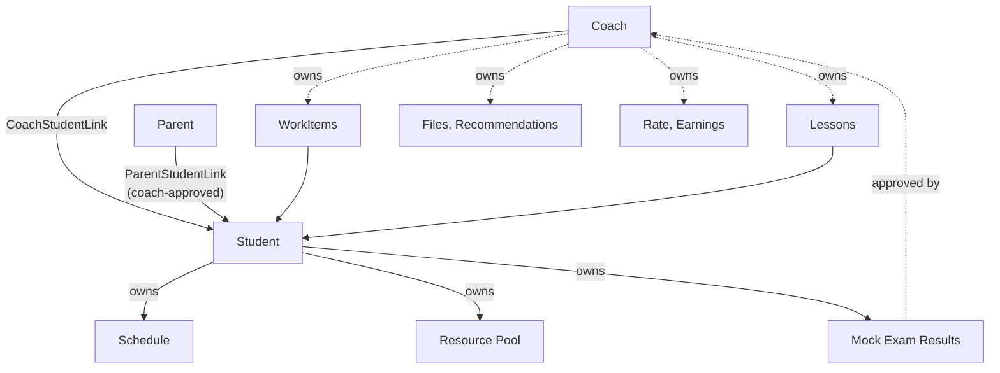

# Domain Model

Business concepts from catalog §36, resolved into a design. This is the *domain*, not the schema —
tables live in [[Data Model]].

## The shape of the thing

Everything hangs off two relationships. Not off the user, not off the student — off the **link**.

Read that diagram as the authorization model too: if a piece of data is not reachable from the
caller through an **active link**, they cannot see it ([[BR-024]]).

## Aggregates

### Identity

| Concept | Notes |
| --- | --- |
| `User` | credentials, contact, locale, role |
| `Coach` / `Student` / `Parent` | role profiles; `Student` holds `gradeLevel` and exam track ([[FR-03]]) |

One role per user in v1 ([[Open Questions|Q-08]]).

### Relationships

| Concept | Notes |
| --- | --- |
| `CoachStudentLink` | the unit of access. Has a lifecycle and an end date, never deleted ([[FR-04]]) |
| `InviteCode` | single-use, expiring, produces a link on acceptance |
| `ParentStudentLink` | requires coach approval; max 2 active ([[BR-003]], [[BR-004]]) |
| `ParentSharingSettings` | which categories the coach opened to parents ([[FR-20]], [[Open Questions\|Q-05]]) |

### Work

| Concept | Notes |
| --- | --- |
| `WorkItem` | task or assignment, discriminated by `type` ([[ADR-0005]]) |
| `WorkItemSubmission` | one per student "done"; a returned item gets another |
| `WorkItemEvent` | the append-only history that derives status ([[FR-21]]) |

**Status is derived, not stored as truth.** `OVERDUE` is a function of `dueAt` and now;
on-time/late is a function of `submittedAt` and `dueAt` resolved at approval. Deriving means the
system can never be stale, and no cron job can forget to run.

### Lessons

| Concept | Notes |
| --- | --- |
| `Lesson` | request → accepted → completed/cancelled ([[FR-09]]) |
| `Attendance` | attended / no-show / cancelled ([[FR-10]]) — the input to money |
| `ScheduleEntry` | student-owned; lessons project into it, they are not copied ([[FR-11]]) |

### Study material

| Concept | Notes |
| --- | --- |
| `Resource` | a pool item belonging to a student |
| `ResourceRecommendation` | coach → student, retains which coach ([[FR-12]]) |
| `File` + `FileShare` | coach-owned, shared with selected students ([[FR-13]]) |
| `Subject` / `Topic` | shared vocabulary for resources and exam results |

Note the collision the Turkish hides: **"ders" means two things** — a coaching session (`Lesson`)
and a school subject (`Subject`). Keep them apart in code or the confusion is permanent.

### Exams

| Concept | Notes |
| --- | --- |
| `MockExamResult` | header: name, type, date, totals, approval status |
| `MockExamSubjectResult` | per-subject correct/wrong/blank/net/score, all manual in v1 |

### Money

| Concept | Notes |
| --- | --- |
| `CoachStudentRate` | effective-dated price per relationship ([[FR-18]]) |
| `TimesheetEntry` | which lessons count as billable |
| `Earning` | amount + **frozen rate snapshot** ([[BR-023]]) |
| `Subscription` | coach ↔ platform, unrelated to the above ([[FR-22]]) |

See [[Pricing and Earnings]] for why this is three concepts and not one.

### Platform

| Concept | Notes |
| --- | --- |
| `Notification` | one row per recipient per event, structured payload |
| `NotificationTemplate` | coach-owned reusable text, per audience |
| `AuditLog` | append-only, actor + timestamp ([[FR-21]]) |

## Invariants

1. Access derives from an **active link**, never from a role alone. ([[BR-024]])
2. Every coach-created row carries `coachId` and is filtered by it on every read.
3. `submittedAt` and `approvedAt` are never interchanged. ([[BR-009]])
4. Money rows carry their own rate snapshot. ([[BR-023]])
5. Nothing is hard-deleted. ([[BR-025]])
6. Statistics read only approved exam results. ([[BR-017]])
7. Task and assignment progress are computed separately. ([[BR-005]])

## Related

[[Data Model]] · [[State Machines]] · [[Authorization Matrix]] · [[Pricing and Earnings]] · [[Progress and Filiz]]
