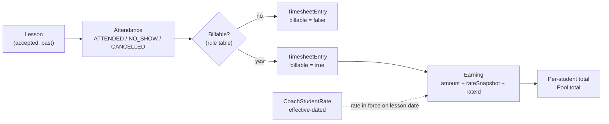

# Pricing and Earnings (Fiyat · Puantaj · Hakediş)

The financial model, in one place, because it is the part most likely to be implemented as "a price
column and a SUM" — which would break [[BR-023]] on the first price change.

## Three concepts, not one

| Concept | Turkish | What it is | Changes when |
| --- | --- | --- | --- |
| **Rate** | Fiyat | what this coach charges this student, valid from a date | the coach renegotiates |
| **Timesheet entry** | Puantaj | a lesson that counts, and whether it is billable | attendance is recorded |
| **Earning** | Hakediş | the money owed for that lesson, with a frozen rate | the timesheet entry is created |

Collapsing them loses the ability to answer "why is this month 12,000 TL?" — which is the only
question a coach will actually ask.

## The pipeline



## Effective-dated rates

```
CoachStudentRate
  id, coachId, studentId
  amountMinor, currency
  effectiveFrom, effectiveTo   -- null = current
  createdBy, createdAt
```

- Setting a new price **closes** the current row and **inserts** a new one. Never `UPDATE amount`.
- The rate for a lesson on date `D` is the row where `effectiveFrom <= D < coalesce(effectiveTo, ∞)`.
- A price is therefore auditable by construction: the whole history is the table.

## Why the snapshot as well

[[BR-023]] is enforced twice on purpose:

1. Effective dating means a past lesson resolves to the rate that was in force then.
2. `Earning.rateSnapshotMinor` means that even if someone later corrects a rate row's dates, the
   calculated amount does not move.

Redundant, cheap, and it protects the one number a coach will notice immediately if it changes.

## When recalculation is allowed

| Event | Recalculate? |
| --- | --- |
| Attendance corrected (`ATTENDED` → `NO_SHOW`) | **yes** — the fact changed |
| A lesson is cancelled after the fact | **yes** — the fact changed |
| The billing rule configuration changes | **no** for past periods; new rule applies going forward |
| The student's price changes | **never** ([[BR-023]]) |

Every recalculation writes an audit entry ([[FR-21]]) — money moving silently is a support ticket.

## Billing rules (defaults, configurable)

| Attendance | Billable | Rationale |
| --- | --- | --- |
| `ATTENDED` | yes | obvious |
| `NO_SHOW` | yes | the coach held the slot and was there |
| `CANCELLED` | no | v1 simplification |

Open: whether cancellation billing should depend on who cancelled and how much notice was given
([[Open Questions|Q-03]], [[Open Questions|Q-04]]). Both are likely to become real rules once
coaches use this — a student cancelling an hour before is not the same as a coach cancelling a week
ahead. Keep the rule table shaped so `cancelledBy` and notice period can join it later.

## What the coach sees

- Per student, per month: lessons, dates, rate applied, amount, total.
- Across the whole student pool, per month: one total, and the per-student breakdown behind it
  ([[FR-19|FR-19.9]] — the client's addendum, and the feature that replaces their notebook).
- Unrecorded attendance on past lessons must be visible as *missing*, not silently excluded, or the
  total is wrong in a way nobody notices until month end.

## What the parent sees

Their own child's price and amounts, per coach ([[BR-022]]). **Never** the coach's pool total across
other families.

## What the student sees

Nothing. Not a price, not an amount, not a hint of one in a lesson detail response ([[BR-022]]).

## Money representation

- Integer **minor units** (kuruş) plus an ISO currency code. No floats, ever.
- Default currency TRY. Model it explicitly anyway — Turkish inflation makes multi-currency pricing
  a plausible future request.
- Rounding, when we eventually prorate: round half up at the earning row, never at the sum.

## Related

[[FR-18]] · [[FR-19]] · [[BR-020]] · [[BR-021]] · [[BR-022]] · [[BR-023]] · [[ADR-0004]]
