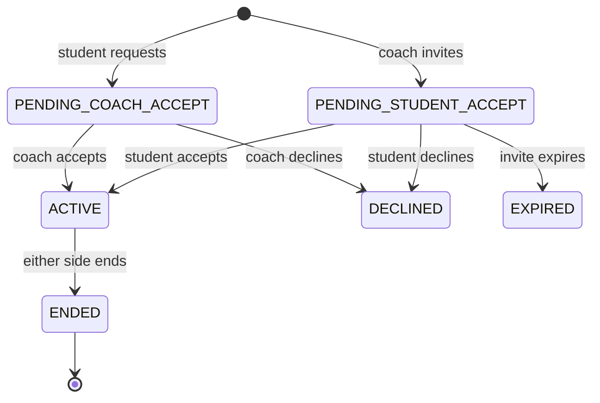
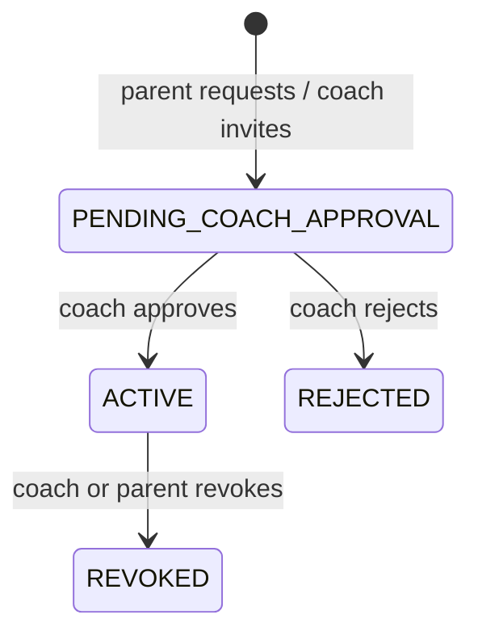
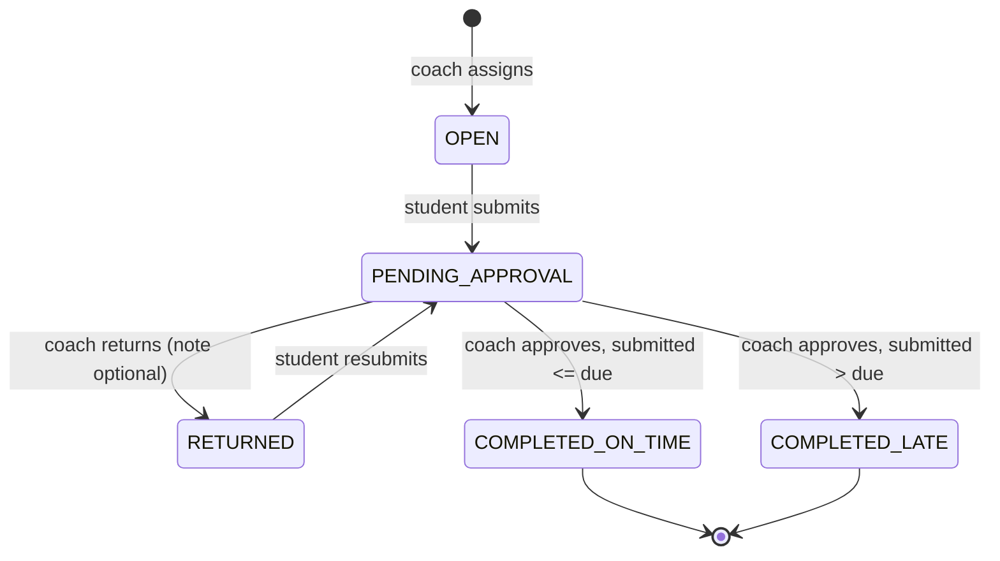
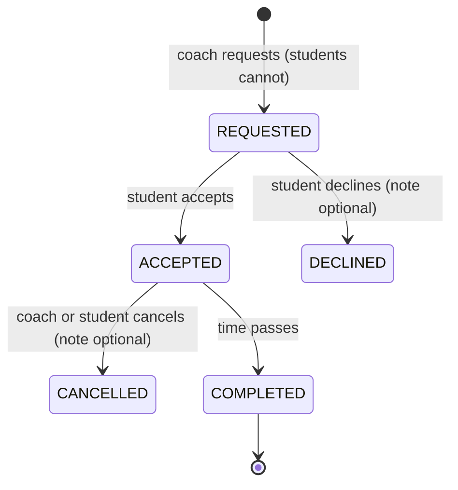
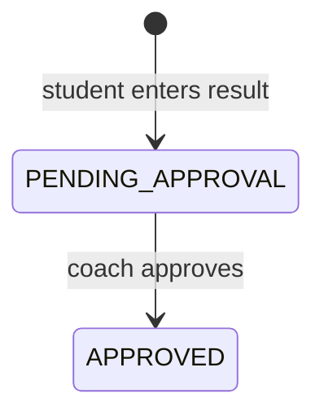
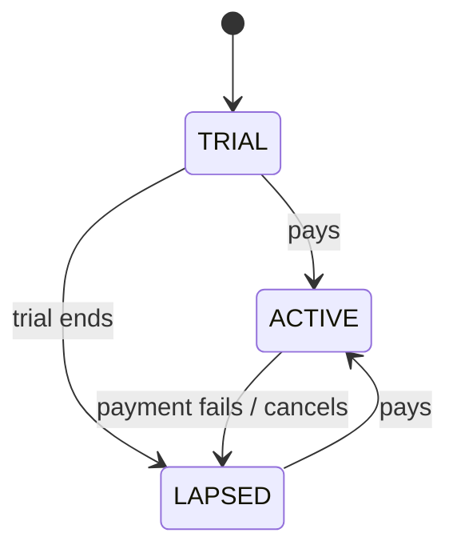

# State Machines

Every transition below is guarded by *who* may perform it. The actor is part of the machine, not an
afterthought.

## Coach–student link ([[FR-04]])

`ENDED` is terminal for that record; the pair may create a new link later. History survives
([[BR-002]], [[BR-025]]).

## Parent–student link ([[FR-05]])

At most two links may be `ACTIVE` per student ([[BR-004]]).

## Work item — task and assignment ([[FR-06]], [[FR-07]])

**`OVERDUE` is not a state in this diagram on purpose.** It is a *view* of `OPEN` or `RETURNED` once
`now > dueAt`. Deriving it avoids a scheduled job and can never be stale.

Guards:

| Transition | Who |
| --- | --- |
| assign | the coach, with an active link |
| submit / resubmit | the student the item belongs to |
| approve / return | **only the assigning coach** ([[BR-007]]) |

The on-time/late branch uses `submittedAt`, never `approvedAt` ([[BR-009]]).

## Lesson ([[FR-09]], [[FR-10]])

Attendance is recorded against the outcome:

| Lesson outcome | Attendance | Billable (default) |
| --- | --- | --- |
| `COMPLETED`, student came | `ATTENDED` | yes |
| `COMPLETED`, student absent | `NO_SHOW` | yes |
| `CANCELLED` | `CANCELLED` | no |

Billability is configuration, not code ([[Open Questions|Q-03]], [[Open Questions|Q-04]]).

## Mock exam result ([[FR-15]])

Only `APPROVED` feeds statistics ([[BR-017]]). A rejection state may be added later
([[Open Questions|Q-16]]).

## Subscription ([[FR-22]])

`LAPSED` restricts the coach's writes. It never locks students or parents out of their own data.

## Related

[[Domain Model]] · [[Authorization Matrix]] · [[Data Model]]
