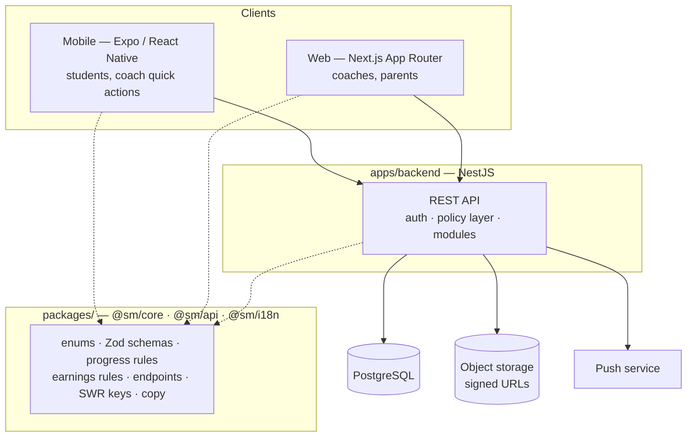

# Architecture Overview

## Shape

One API, three clients, one shared domain package.



## Why this shape

- **One backend, all authorization.** [[BR-024]] and [[BR-022]] are not enforceable if two clients
  each decide what to show. Every rule lives in [[FR-02]]'s policy layer and nowhere else.
- **A shared package, not three copies.** Filiz stages and earnings amounts must be identical on
  mobile, web and in reports. Duplicated logic drifts, and the disagreement surfaces to the user as
  a bug they cannot explain.
- **Two clients, because the audiences differ.** A student lives on a phone; a coach assigning work
  to 30 students and doing monthly accounting wants a keyboard. Building one responsive app for both
  would compromise both.

## Backend structure

Modules mirror the requirement areas — a reviewer should be able to map a module to an FR note:

```
apps/backend/src/
  auth/            login, tokens, password reset            FR-01
  users/           profiles, grade level                    FR-01 FR-03
  links/           coach-student, parent-student, invites   FR-04 FR-05
  work-items/      tasks + assignments, submit/approve      FR-06 FR-07
  lessons/         requests, cancellation, attendance       FR-09 FR-10
  schedule/        student schedule entries                 FR-11
  resources/       pool + recommendations                   FR-12
  files/           upload, share, signed URLs               FR-13
  exams/           mock exam results + approval             FR-15
  progress/        daily/weekly/monthly, Filiz              FR-08 FR-14
  notifications/   events, templates, push                  FR-16
  billing/         rates, timesheet, earnings               FR-18 FR-19
  subscriptions/   coach plans                              FR-22
  audit/           append-only event log                    FR-21
  common/
    policy/        capability resolution, guards            FR-02  ← the important one
```

### The policy layer

The single most important piece of this codebase. Once per request it resolves:

> Which students can this caller see, in what capacity, and which of their data do they own?

Every query then scopes against that result. The alternative — permission checks written per
controller — is how [[BR-024]] gets broken by a Tuesday-afternoon feature. See [[ADR-0006]].

## Data

PostgreSQL, accessed through Prisma. Reasons in [[ADR-0003]]. Notable choices:

- Every coach-owned table carries `coachId`, indexed with `studentId`.
- Effective-dated rates and snapshotted earnings ([[ADR-0004]]).
- Append-only audit log written in the same transaction as the change.
- No hard deletes anywhere ([[BR-025]]).

## Cross-cutting

| Concern | Approach |
| --- | --- |
| Auth | JWT access token + rotating refresh token; refresh stored in secure storage on mobile, httpOnly cookie on web |
| Validation | Zod schemas in `@sm/core`, used by the API and both clients |
| Errors | typed error codes, translated client-side; 404 instead of 403 for invisible rows |
| Time | UTC in the database; `Europe/Istanbul` for all business-day boundaries |
| Money | integer minor units + currency |
| i18n | Turkish first; keys not literals, so English is possible later |
| Background work | bulk notifications and digests as queued jobs, not request-scoped loops |
| Files | S3-compatible storage, short-lived signed URLs, never public objects |

## Scale reality check

A coach has ~30 students. A hundred coaches is 3,000 students and maybe 100k work items a year. This
is a **small** dataset. Resist the urge to pre-build rollup tables, caching layers or read replicas;
compute reports on read and revisit when something is measurably slow. The complexity budget is
better spent on authorization correctness.

## Related

[[Tech Stack]] · [[Data Model]] · [[API Conventions]] · [[Security and Privacy]] · [[ADR Index]]
