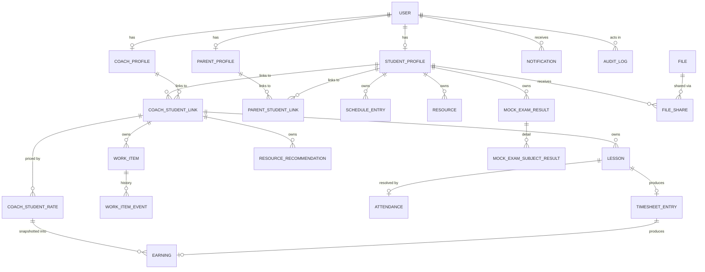

# Data Model (draft ERD)

First-cut schema for [[Domain Model]]. Draft — it will change as we build, and that is fine; what
must not change casually are the parts marked **invariant**.



## Key tables

### coach_student_link — **invariant**

```
id, coach_id, student_id, status, initiated_by,
requested_at, accepted_at, ended_at, ended_by
```

- Partial unique index: one `ACTIVE` row per `(coach_id, student_id)`.
- `ENDED` rows stay forever ([[BR-025]]). Re-linking creates a new row.
- **This table is the access boundary.** Most queries join through it.

### parent_student_link — **invariant**

```
id, parent_id, student_id, status,
approved_by_coach_id, approved_at, revoked_at
```

- At most 2 `ACTIVE` rows per `student_id`, enforced in the database ([[BR-004]]), not only in code.
- `approved_by_coach_id` is not nullable for `ACTIVE` rows ([[BR-003]]).

### work_item

```
id, type,                         -- TASK | ASSIGNMENT
coach_id, student_id,             -- coach_id is never null  (BR-024)
title, description, due_at,
created_at, created_by,
submitted_at, approved_at, approved_by,   -- latest of each
final_state,                      -- null until approved
return_note
```

- `type` discriminates tasks and assignments ([[ADR-0005]]); every statistic groups by it.
- `submitted_at` and `approved_at` are separate columns and are never conflated ([[BR-009]]).
- `OVERDUE` is **not** stored — it is derived from `due_at`, `submitted_at` and now.
- Index `(student_id, due_at)` and `(coach_id, due_at)`.

### work_item_event

```
id, work_item_id, actor_id, event_type, note, created_at
```

Append-only: `CREATED`, `SUBMITTED`, `RETURNED`, `APPROVED`, `EDITED`. Satisfies §8 and drives
status derivation ([[FR-21]]).

### lesson / attendance

```
lesson(id, coach_id, student_id, starts_at, ends_at, title, status,
       decline_note, cancelled_by, cancelled_at, cancel_note)
attendance(lesson_id PK, state, recorded_by, recorded_at)
```

### schedule_entry

```
id, student_id, kind, title, starts_at, ends_at, lesson_id?
```

- `kind`: `SCHOOL | TASK | ASSIGNMENT | MOCK_EXAM | PERSONAL | LESSON`.
- Free time is the **absence** of rows ([[FR-11|FR-11.4]]) — never materialise "free" entries.
- Coach-facing queries filter `kind = LESSON AND coach_id = :caller` ([[BR-014]]).

### coach_student_rate — **invariant**

```
id, coach_id, student_id, amount_minor, currency,
effective_from, effective_to,     -- null = current
created_by, created_at
```

Never updated in place. See [[Pricing and Earnings]].

### timesheet_entry / earning — **invariant**

```
timesheet_entry(id, lesson_id, coach_id, student_id, lesson_date, billable, rule_applied)
earning(id, timesheet_entry_id, coach_id, student_id, period_month,
        amount_minor, currency, rate_id, rate_snapshot_minor, created_at)
```

`rate_snapshot_minor` is what makes [[BR-023]] hold even if a rate row is later corrected.

### mock_exam_result / mock_exam_subject_result

```
result(id, student_id, name, exam_type, taken_on,
       total_net, total_score, status, approved_by_coach_id, approved_at, entered_by)
subject(id, result_id, subject, correct, wrong, blank, net, score)
```

All numeric fields nullable and manually writable ([[BR-018]]); no fixed formula ([[BR-019]]).
`net` is numeric with decimals — a net of 42.75 is normal.

### audit_log

```
id, actor_id, entity_type, entity_id, action, payload jsonb, created_at
```

Append-only, written in the same transaction as the change ([[FR-21]]).

## Conventions

- UUID v7 primary keys (sortable, no sequence contention, safe to expose).
- `timestamptz`, always UTC.
- Money: `integer` minor units + `currency char(3)`. Never `float`, never `numeric` for money.
- No `ON DELETE CASCADE` anywhere. Deleting is not a thing we do ([[BR-025]]).
- Every coach-owned table has an index leading with `coach_id`.

## Open

- Do we need a shared resource catalogue, or is per-student free text enough for v1? ([[FR-12]])
- Recurrence representation for schedule entries ([[Open Questions|Q-15]]).
- Whether `work_item` needs a separate `submission` table for multiple attempts, or whether the
  event log is sufficient. Leaning event log.

## Related

[[Domain Model]] · [[Pricing and Earnings]] · [[Architecture Overview]] · [[ADR-0004]] · [[ADR-0005]]
