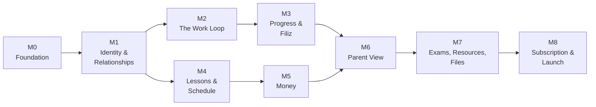

# Roadmap

Sequenced by **dependency and risk**, not by how exciting a feature is. No dates — this is an
ordering, and durations depend on who is building it.

M2 and M4 can run in parallel once M1 lands — they share only the link model.

| Milestone | Goal | Requirements |
| --- | --- | --- |
| **M0** Foundation | repo, CI, database, deployable skeleton | — |
| **M1** Identity & relationships | a coach and student can find each other; a parent can be approved | [[FR-01]] [[FR-02]] [[FR-03]] [[FR-04]] [[FR-05]] |
| **M2** The work loop | assign → submit → approve/return, with honest lateness | [[FR-06]] [[FR-07]] [[FR-21]] |
| **M3** Progress & Filiz | daily and weekly progress; the character; coach follow-up | [[FR-08]] [[FR-14]] [[FR-17]] [[FR-16]] |
| **M4** Lessons & schedule | request/accept/cancel, attendance, the student's private calendar | [[FR-09]] [[FR-10]] [[FR-11]] |
| **M5** Money | per-student rates, timesheet, earnings, pool total | [[FR-18]] [[FR-19]] |
| **M6** Parent view | approved parents see what the coach opened, including money | [[FR-20]] |
| **M7** Exams, resources, files | mock exam tracking with approval; resource pool; file sharing | [[FR-15]] [[FR-12]] [[FR-13]] |
| **M8** Subscription & launch | plans, enforcement switch, monthly reporting, KVKK paperwork | [[FR-22]] [[FR-14]] |

## Why this order

1. **M1 before everything** — the link *is* the authorization model ([[BR-024]]). Building features
   first and retrofitting scoping is how the rules get broken.
2. **M2 next** — it is the product ([[Scope and MVP]]). If the submit/approve loop is not pleasant
   on a phone, nothing downstream matters.
3. **M3 immediately after** — progress is what makes the loop *feel* worth doing, for both sides.
   The work loop without feedback is a chore list.
4. **M4 before M5** — earnings are computed from attendance ([[BR-021]]); there is nothing to bill
   before lessons exist.
5. **M6 after M5** — a parent view without the financial half is half a product to the person who
   actually pays.
6. **M7 is self-contained** — valuable, but nothing depends on it. It ships when the core is solid.
7. **M8 last** — charge only once the thing is worth paying for, and once [[Open Questions|Q-10]]
   is answered.

## Risks

| Risk | Impact | Mitigation |
| --- | --- | --- |
| Authorization leakage between coaches | trust-destroying; the one bug we cannot ship | policy layer in M1 ([[ADR-0006]]); negative tests from the first endpoint |
| Open business rules answered late | rework in M3, M5, M8 | placeholders isolated in one module; chase [[Open Questions]] before those milestones |
| Money correctness | a coach's income is wrong → they leave | [[ADR-0004]]; property tests on the rate/earning pipeline |
| Two clients doubling the work | slips everything | shared package; mobile carries the student experience only at first |
| KVKK / minors' consent discovered late | launch blocker | resolve [[Open Questions\|Q-12]] and hosting region during M0–M1 |
| Coaches never adopt because entry is tedious | no customers | bulk assignment and templates are not optional polish; test with a real coach in M3 |

## Before M8, talk to a real coach

Everything after M3 is a guess about workflow until someone with 30 students uses it for a week.
Book that early — it is cheaper than building M7 in the wrong shape.

## Related

[[Milestones]] · [[Task Board]] · [[Scope and MVP]] · [[Open Questions]]
