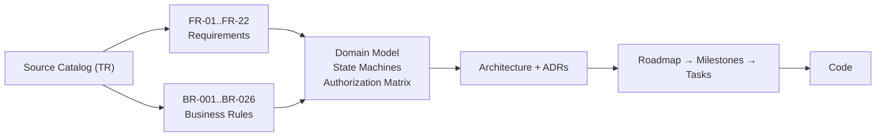

# Student Monitor — Documentation Vault

Coaching platform for Turkish exam preparation (YKS / LGS), used alongside regular school by
**coaches (koç)**, **students (öğrenci)** and **parents (veli)**.

> [!info] How to read this vault
> The client's requirement catalog is in Turkish and lives untouched in
> [[Source - Requirement Catalog (TR)]]. Everything else is written in English, with
> [[Glossary]] mapping every domain term TR ↔ EN ↔ code identifier.

## Start here

- [[Vault Guide]] — conventions, IDs, statuses, how to add a note
- [[Product Vision]] — what this is and who it is for
- [[Scope and MVP]] — what we build first, what we defer
- [[Open Questions]] — decisions the client still owes us
- [[Requirements Index]] — all 22 functional areas
- [[Business Rules Index]] — the 26 hard rules (İK-001..İK-026)

## Map



## Sections

| Folder | Contents |
| --- | --- |
| `00-Meta` | [[Vault Guide]], [[Glossary]], note templates |
| `01-Product` | vision, personas, scope, open questions, the original Turkish catalog |
| `02-Requirements` | FR notes per functional area + business rules |
| `03-Domain` | [[Domain Model]], [[State Machines]], [[Authorization Matrix]], [[Pricing and Earnings]], [[Progress and Filiz]] |
| `04-Architecture` | [[Architecture Overview]], [[Tech Stack]], [[Frontend Architecture]], [[Data Model]], [[API Conventions]], [[Security and Privacy]], ADRs |
| `05-Delivery` | [[Roadmap]], [[Milestones]], [[Task Board]], task notes |
| `06-Design` | [[UX Principles]], [[Screen Inventory]] |
| `99-Archive` | superseded notes, kept for history |

## Current state

- [x] Requirements captured from the client catalog and given IDs
- [x] Domain model and authorization matrix drafted
- [ ] Open questions answered by the client → [[Open Questions]]
- [ ] Repo scaffolded (M0) → [[Roadmap]]
- [ ] First vertical slice: auth + coach–student link (M1)

```dataview
TABLE status, priority, source
FROM "02-Requirements"
WHERE id != null AND status != null
SORT id ASC
```
